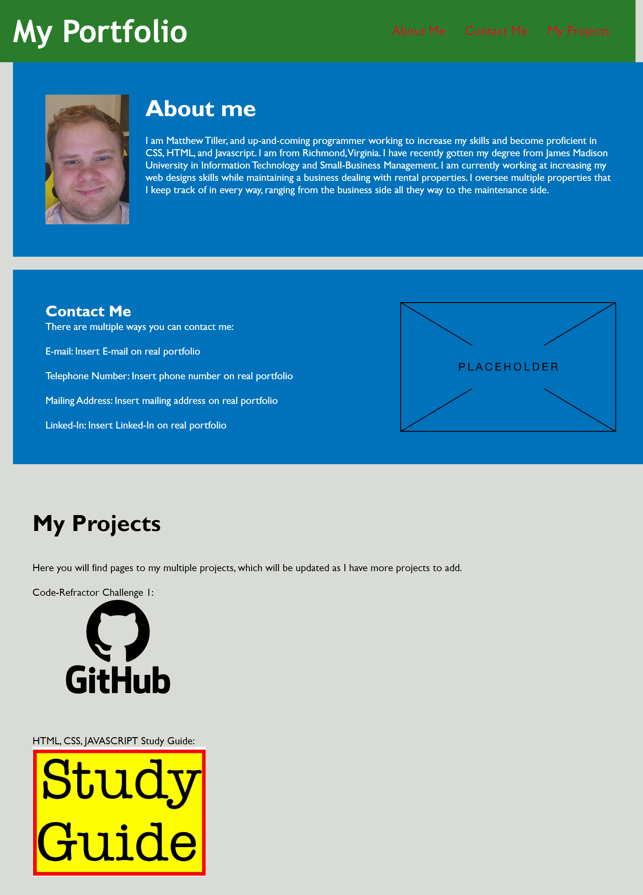

# challenge2-portfolio

## What This Project Is:

This project is to create the beginning of my portfolio. It will be added to over time as I acrew more projects. I already have plans for the next iteration to be completely different. I want to create a better layout and more condensed code in the future.

## What I Did:

I created a portfolio page with a basic layout. This layout will change in the future and it will become more advanced as I learn more skills

## Image Of Site:

## Project By:

Matthew Tiller